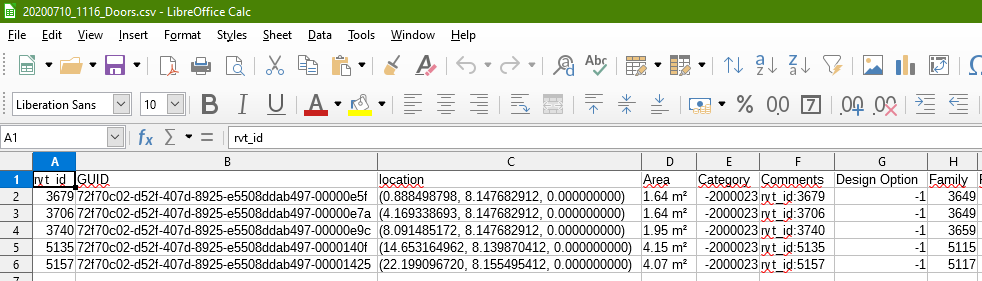
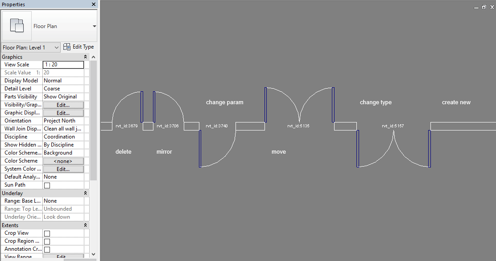
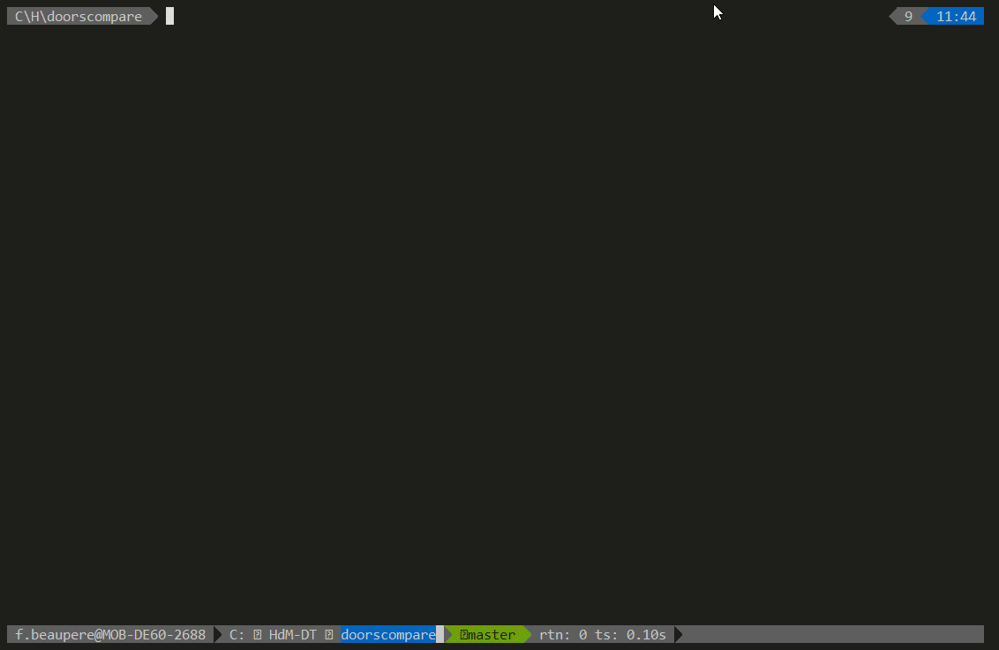
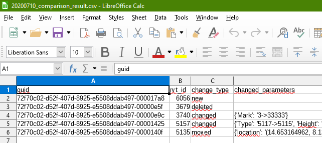
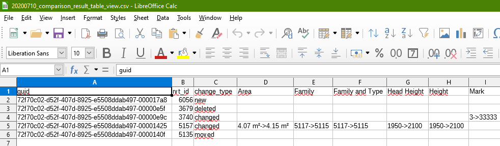

# rvt_data_dump_compare

## high level overview

This rvt_data_dump_compare repo describes a workflow of retrieving 
element data from rvt via a [pyRevit](https://github.com/eirannejad/pyRevit) 
script called rvt_data_dump and comparing it to previous data dumps.

### rvt_data_dump
So let's look into a simple demo model with a wall and a few doors. 
(This process has been running on projects with a few thousands of doors, 
but here we keep the example short and simple)

#### only read out data:
To read out the door data is as easy as running the pyRevit script:

This reads out a csv table to the specified location. 
The data that is being captured:  
`<rvt_id> ; <GUID> ; <location> ; <door instance data> ; <door type data>`
One line per door:

#### changes and read out data:
To showcase the change tracking later, we apply some changes to the doors 
and repeat the data dump:

### doors_compare
Now it is time to compare the two data sets. 
No rvt needed here we will compare with the doors_compare Python script.
So open your favourite terminal ( [cmder](https://github.com/cmderdev/cmder) 
and [xonsh](https://github.com/xonsh/xonsh) shell are used in this example )

As we can see we get a detailed report, on the console. 
But we also get two more csv tables:
`*_comparison_result.csv`
`*_comparison_result_table_view.csv`

In `comparison_result` all the changes are written into one column named 
"changed parameters" in the form of: 
`{'<param_name>': '<previous_value> -> <current_value>'}` in our example: `{'Mark': '3->33333'}`

The `comparison_result_table_view` csv on the other hand shows only changed 
parameter values but with a column for each parameter:

